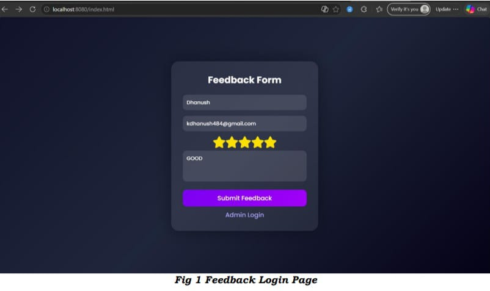
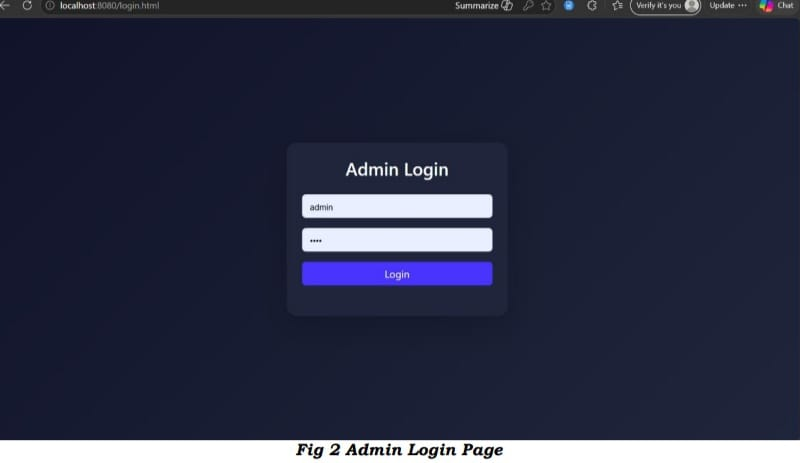
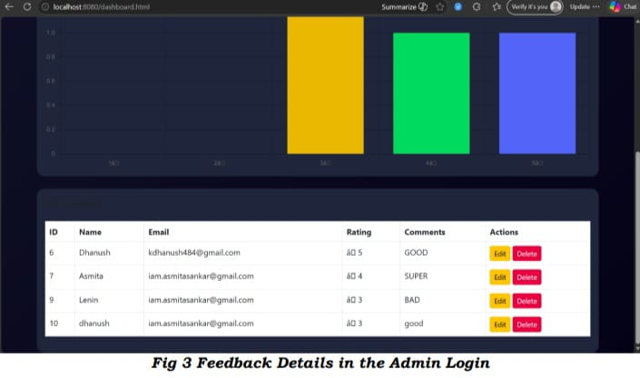

# Feedback Management System

A modern **Feedback Management System** built using **Java Spring Boot** that enables users to submit, manage, and analyze feedback efficiently. The application provides a user-friendly interface for submitting feedback and an admin dashboard for managing feedback records. It follows a layered architecture using Spring Boot, Spring Data JPA, and MySQL.


---

# Features

- User-friendly feedback submission form
- Five-star rating system
- Admin login authentication
- Admin dashboard to manage feedback
- View all submitted feedback
- Update feedback records
- Delete feedback records
- RESTful API architecture
- Spring Boot MVC architecture
- Spring Data JPA integration
- MySQL database support
- Exception handling
- Form validation
- Responsive UI
- Maven project structure

---

# 📸 Application Screenshots

## Feedback Submission Page

<p align="center">
  
</p>

<p align="center">
<b>Fig 1.</b> Feedback Submission Page
</p>

---

## Admin Login Page

<p align="center">
  
</p>

<p align="center">
<b>Fig 2.</b> Admin Login Page
</p>

---

## Admin Dashboard

<p align="center">
  
</p>

<p align="center">
<b>Fig 3.</b> Feedback Management Dashboard
</p>

---

# Tech Stack

| Technology | Description |
|------------|-------------|
| Java 17+ | Programming Language |
| Spring Boot 3.x | Backend Framework |
| Spring MVC | Web Framework |
| Spring Data JPA | Database Layer |
| Hibernate | ORM Framework |
| MySQL | Relational Database |
| Maven | Build Tool |
| HTML5 | Frontend |
| CSS3 | Styling |
| JavaScript | Client-side Scripting |
| REST API | Communication |
| Git | Version Control |
| GitHub | Repository Hosting |

---

# Project Structure

```
Feedback_Management_System
│
├── screenshots
│   ├── feedback-form.png
│   ├── admin-login.png
│   └── admin-dashboard.png
│
├── src
│   ├── main
│   │   ├── java
│   │   │   └── com.feedback
│   │   │        ├── controller
│   │   │        ├── entity
│   │   │        ├── repository
│   │   │        ├── service
│   │   │        ├── dto
│   │   │        ├── exception
│   │   │        └── FeedbackManagementApplication.java
│   │   │
│   │   └── resources
│   │        ├── static
│   │        ├── templates
│   │        └── application.properties
│   │
│   └── test
│
├── pom.xml
└── README.md
```

---

# Installation

## Clone the Repository

```bash
git clone https://github.com/Dhanushkumarsekar/Feedback_Management_System-Java.git
```

```bash
cd Feedback_Management_System-Java
```

---

# Prerequisites

- Java 17 or later
- Maven
- MySQL Server
- IntelliJ IDEA / Eclipse / VS Code

---

# Database Configuration

Open the **application.properties** file and update your MySQL credentials.

```properties
spring.datasource.url=jdbc:mysql://localhost:3306/feedback_db
spring.datasource.username=root
spring.datasource.password=your_password

spring.jpa.hibernate.ddl-auto=update
spring.jpa.show-sql=true
spring.jpa.properties.hibernate.format_sql=true
```

---

# Build the Project

```bash
mvn clean install
```

---

# Run the Application

Using Maven

```bash
mvn spring-boot:run
```

Or

```bash
java -jar target/*.jar
```

Application will start at

```
http://localhost:8080
```

---

# Application Workflow

```
User
   │
   ▼
Feedback Form
   │
   ▼
Submit Feedback
   │
   ▼
Spring Boot Backend
   │
   ▼
MySQL Database
   │
   ▼
Admin Login
   │
   ▼
Admin Dashboard
   │
   ├── View Feedback
   ├── Edit Feedback
   └── Delete Feedback
```

---

# REST API Endpoints

| Method | Endpoint | Description |
|---------|----------|-------------|
| POST | /feedback | Submit feedback |
| GET | /feedback | Get all feedback |
| GET | /feedback/{id} | Get feedback by ID |
| PUT | /feedback/{id} | Update feedback |
| DELETE | /feedback/{id} | Delete feedback |

> Update these endpoints if your project uses different mappings.

---

# Sample Request

```json
{
  "name": "John Doe",
  "email": "john@example.com",
  "rating": 5,
  "comments": "Excellent application!"
}
```

---

# Sample Response

```json
{
  "id": 1,
  "name": "John Doe",
  "email": "john@example.com",
  "rating": 5,
  "comments": "Excellent application!"
}
```

---

# Future Enhancements

- JWT Authentication
- Spring Security
- Role-Based Access Control
- Email Notifications
- Pagination
- Search and Filtering
- Dashboard Analytics
- Export Feedback to PDF/Excel
- Swagger/OpenAPI Documentation
- Docker Support
- Unit Testing
- Integration Testing
- Cloud Deployment (AWS/Azure)

---

# Author

**Dhanushkumar Sekar**

📧 Email: kdhanush484@gmail.com

🔗 GitHub: https://github.com/Dhanushkumarsekar

🔗 LinkedIn: https://www.linkedin.com/in/dhanush44/

🌐 Portfolio: https://quiet-empanada-f231a3.netlify.app/

---

# Contributing

Contributions are welcome!

1. Fork the repository.
2. Create a feature branch.

```bash
git checkout -b feature-name
```

3. Commit your changes.

```bash
git commit -m "Add new feature"
```

4. Push the branch.

```bash
git push origin feature-name
```

5. Create a Pull Request.

---

# License

This project is licensed under the **MIT License**.

---

# Support

If you find this project useful, please consider giving it a ⭐ on GitHub.

It helps others discover the project and supports future development.

---

## ⭐ Star the Repository if you like this project!
